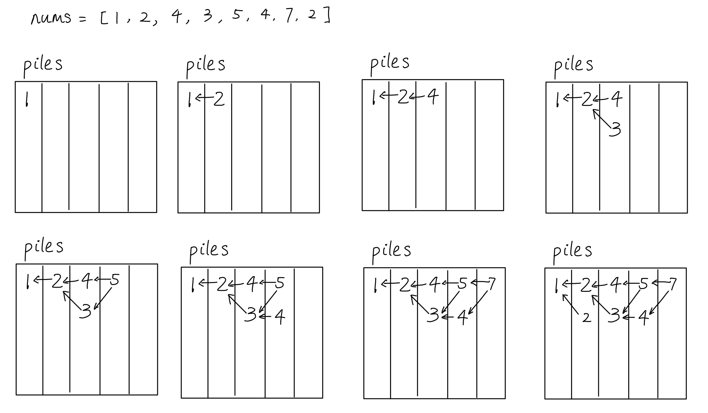
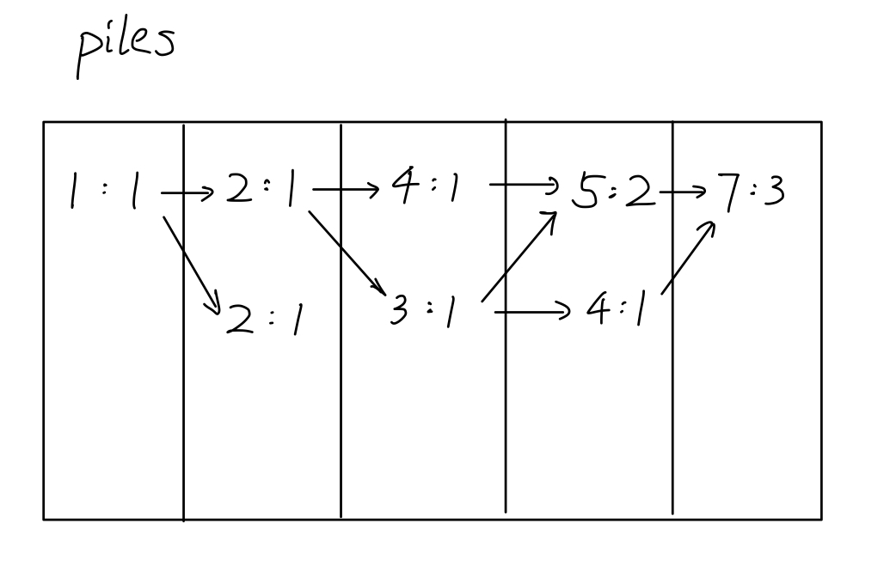

# Number of Longest Increasing Subsequences
## Topics
Patience Sort, Binary Search, DP

## Complexity
Time: O(n^2). DP tracks all `nums[i]`, `nums[j]` s.t. `i < j` and `nums[i] < nums[j]`. In the worst case where `nums` is sorted, there are O(n^2) such pairs.

Space: O(n). Each `num` maps to one pair in `piles`.
## Insights
1. **Patience Sort** can find all the longest increasing subsequences(LIS). For each `num` in `nums`, patience sort chooses the left-most pile from `piles` that has a top number no less than `num` and put `num` on top of that pile. Below is an example of patience sort:

2. For each `num` in a pile, we can "maintain" pointers to all smaller numbers in the previous pile. Tracing back the pointers from the last column can recover all the LIS's. The example above has three LIS's:
   1. 1 - 2 - 4 - 5 - 7
   2. 1 - 2 - 3 - 5 - 7
   3. 1 - 2 - 3 - 4 - 7
3. Because we are concerned with number of LIS's, while inserting `num` into `piles`, we also store the number of increasing substrings that end with `num`, and propagate it forward using DP:



## Helper functions
### binSearch
Given `target`, return the index of the left-most pile in `piles` whose top element is no less than `target`. It's very similar to the regular binary search function, except we are comparing the top of each pile to `target`.

```java
private int binSearch(List<List<int[]>> piles, int target) {
    int lo = 0;
    int hi = piles.size() - 1;
    while (lo <= hi) {
        int mid = (lo + hi) / 2;
        List<int[]> pile = piles.get(mid);
        List<int[]> prevPile = null;
        if (mid > 0) prevPile = piles.get(mid - 1);
        // compare pile top with target
        if (pile.get(pile.size() - 1)[0] < target) {
            lo = mid + 1;
        } else if (mid == 0 || prevPile.get(prevPile.size() - 1)[0] < target) {
            return mid;
        } else {
            hi = mid - 1;
        }
    }
    return lo;
}

```

## Main function
1. Create `piles`. It's a list of piles, and each pile is a list of `num`:`cnt` pairs. `num` is a number in `nums`, and `cnt` represent the number of LIS that end with `num`.
    ```java
    List<List<int[]>> piles = new ArrayList<>();
    ```
2. For each `num`, use patience sort to find its inserting index. Track "pointers" to the preivous pile and update `cnt` (DP).
    ```java
    for (int num: nums) {
        int index = binSearch(piles, num);
        int cnt = 0;
        // track "pointers" to previous pile and update cnt
        if (index == 0) {
            cnt = 1;
        } else {
            for (int[] pair: piles.get(index - 1)) {
                if (pair[0] < num) cnt += pair[1];
            }
        }
        // insert num:cnt into piles
        if (index == piles.size()) {
            piles.add(new ArrayList<>());
        }
        piles.get(index).add(new int[]{num, cnt});
    }
    ```
3. Sums `cnt` in the last pile to get the total number of LIS's.
    ```java
    int res = 0;
    for (int[] pair: piles.get(piles.size() - 1)) {
        res += pair[1];
    }
    return res;
    ```